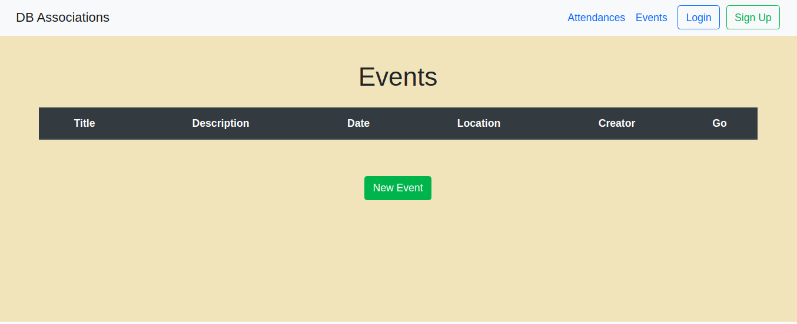

<h1>Rails Associations :diamonds:	</h1> 
This collaborative project is focused on Assosiations, as a part of an assignment for microverse using sessions, associations between users, events, and attendances;  where users can create  events, and register himself to different events created by any other user.




## Authors:
 👤 **Gonza Javier Mancilla**

- Github: [@github/gonjavi](https://github.com/gonjavi)
- Linkedin: [linkedin](https://www.linkedin.com/in/g-javier-mancilla-a686a9178/)

 👤 **Daniel alejandro Salgado**

- Github: [@github/alejocode](https://github.com/AlejoCode)
- Linkedin: [linkedin](https://www.linkedin.com/in/daniel-alejandro-salgado-sanchez-13a740b1/)


## Live Demo

[Live Demo Link](https://alejocode-rails-crud.herokuapp.com/)

## Built With
```bash
  Ruby 2.6.3
 ```
 ```bash
   Ruby on Rails 6.0.1
 ```
  ```bash
   Html5
 ```
  ```bash
   CSS3 - scss
 ```
  ```bash
Bootstrap
```
  ```bash
  PostgresSQL
  ```


## Getting Ruby Set up and necessary gems 

* You would install the latest version of the gems listed in the Gemfile by :

```bash
$ bundle install
```
* Migrate the database with by :
```bash
$ rails db:migrate
```
* Simply run the app with :
```bash
$ rails s
```


## 🤝 Contributing

Contributions, issues and feature requests are welcome!


## Show your support

Give a ⭐️ if you like this project!


